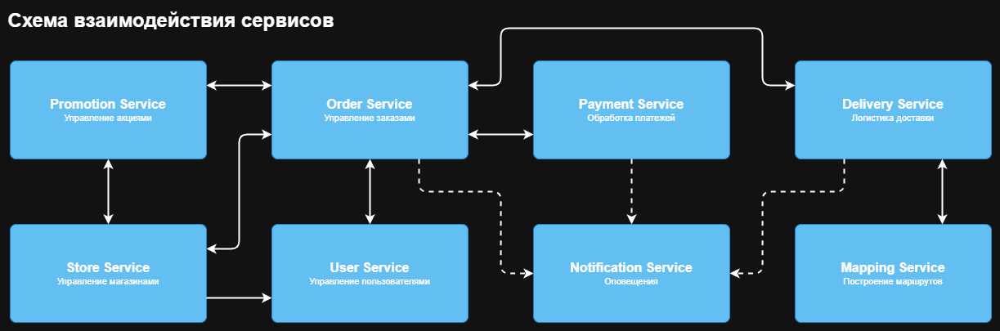

#  Паттерны декомпозиции микросервисов
    I'll Have the BLT (https://nealford.com/katas/list.html)

---

## Пользовательские сценарии
### 1. Управление аккаунтом:
    Пользователь может зарегистрироваться в системе.
    Пользователь может войти в систему.
    Пользователь может сохранить адреса доставки и способы оплаты.
    Пользователь может просматривать историю заказов.
    
### 2. Просмотр акций и специальных предложений:
    Пользователь видит общенациональные акции на главной странице приложения.
    Пользователь видит местные акции для выбранного магазина.
    
### 3. Создание заказа:
    Пользователь открывает приложение.
    Пользователь выбирает магазин (находит ближайший или выбирает конкретный).
    Пользователь просматривает меню.
    Пользователь настраивает свой сэндвич (добавляет ингредиенты, выбирает хлеб и т.д.).
    Пользователь выбирает способ получения заказа (самовывоз или доставка).
    Пользователь оставляет адрес доставки, если не сотавил его ранее в управлении аккаунтом.                     
    Пользователь выбирает способ оплаты (онлайн или при получении).
    Пользователь подтверждает заказ.
    Система показывает пользователю время готовности заказа или ожидаемое время доставки или информацию, как проехать к месту получения заказа.
    Пользователь получает уведомление об изменении статуса заказа (например, "Заказ принят", "Заказ готовится", "Заказ готов к выдаче" или "Водитель в пути", "Как добраться" и т.д.).
   
### 4. Получение заказа самовывозом:
    Пользователь получает уведомление о готовности заказа.
    Пользователь получает указания по проезду к магазину (интегрированные с картографическими сервисами).
    Пользователь забирает заказ в магазине.
       
### 5. Получение заказа доставкой:
    Пользователь получает уведомление о том, что водитель направляется к нему.
    Пользователь может отслеживать местоположение водителя на карте (опционально).
    Водитель доставляет заказ пользователю.
    Пользователь оплачивает заказ (если выбран способ оплаты при получении).
       
### 6. Управление франшизой (для владельцев магазинов):
    Владелец магазина входит в систему.
    Владелец магазина может настраивать меню своего магазина.
    Владелец магазина может настраивать местные акции.
    Владелец магазина может управлять водителями, доставляющими заказы.
    Владелец магазина может управлять статусами заказов.
    Владелец магазина может видеть отчеты о продажах.
    
### 7. Администрирование (для материнской компании):
    Администратор может управлять пользователями, магазинами, акциями, и т.д.
    Администратор может генерировать сводные отчеты по всем магазинам франшизы.

---

### 


---

## Описание сервисов и их зон ответственности
### Store Service
```
Назначение: 
- Управление магазинами.
Зона ответственности:
- Меню, график работы, доступность доставки.
- Интеграция с Order Service для проверки наличия ингредиентов.
- Интеграция с Promotion Service для управления акциями;
- Интеграция с User Service для управления пользователями;
```

### Promotion Service
```
Назначение:
- Управление акциями.
Зона ответственности:
- Общенациональные и локальные акции.
- Применение скидок к заказу.
```

### User Service
```
Назначение: 
- Управление пользователями.
Зона ответственности:
- Профили, история заказов, предпочтения.
```

### Order Service
```
Назначение:
- Управление заказами (создание, статусы, отмена).
Зона ответственности:
- Валидация заказа (наличие ингредиентов в магазине).
- Расчет времени готовности.
- Координация с другими сервисами (Payment Service, Delivery Service).
```

### Payment Service
```
Назначение: 
- Обработка платежей.
Зона ответственности:
- Интеграция с платежными системами.
- Возврат средств при отмене заказа.
```
    
### Delivery Service
```
Назначение: 
- Логистика доставки.
Зона ответственность:
- Назначение водителя.
- Расчет времени доставки с учетом трафика.
```
    
### Notification Service
```
Назначение: 
- Оповещения.
Зона ответственности:
- Уведомления (статус заказа, акции).
```

### Mapping Service
```
Назначение: 
- Построение маршрутов.
Зона ответственности:
- Интеграция с Google Maps, Yandex Maps.
- Расчет времени с учетом пробок.
```

---

## Контракты взаимодействия

### User Service
- GET /users/register - Форма регистрация пользователя
- POST /users/register - Регистрация пользователя
- GET /users/login - Форма логина пользователя
- POST /users/login - Логин пользователя
- POST /users/auth - Аутентификация пользователя
- GET /users/auth - Проверка аутентификации пользователя
- GET /users/{userId} - Получение пользователя
- PUT /users/{userId} - Изменение пользователя
- DELETE /users/{userId} - Удаление пользователя

### Store Service
- GET /stores - Список магазинов
- GET /stores/{storeId} - Получение магазина
- PUT /stores/{storeId} - Изменение магазина
- DELETE /stores/{storeId} - Удаление магазина
- GET /stores/{storeid}/ingredients - Проверка наличия ингредиентов в магазине

### Promotion Service
- GET /promotions - Список акций
- POST /promotions - Создание акции
- GET /promotions/{promotionId} - Получение акции
- PUT /promotions/{promotionId} - Изменение акции
- DELETE /promotions/{promotionId} - Удаление акции
- GET /promotions/local/{storeId} - Список локальных акций магазина
- POST /promotions/local/{storeId} - Создание локальной акции магазина
- GET /promotions/local/{storeId}/{promotionId} - Получение локальной акции магазина
- PUT /promotions/local/{storeId}/{promotionId} - Изменение локальной акции магазина
- DELETE /promotions/local/{storeId}/{promotionId} - Удаление локальной акции магазина
- GET /promotions/apply/ - Запрос акций, применимых к заказу (национальные/локальные)

### Order Service
- GET /orders - Заказы пользователя
- POST /orders/create - Создание заказа
- POST /orders/cancel/{orderId} - Отмена заказа

### Payment Service
- POST /payments/create - Создание платежа
- POST /payments/cancel/{paymentId} - Отмена платежа

### Delivery Service
- POST /deliveries/create - Создание доставки
- GET /deliveries/{deliveryId} - Получение доставки
- PUT /deliveries/{deliveryId} - Обновлние доставки

### Mapping Service
- GET /routes/estimate - Расчет времени и маршрута доставки
- GET /traffic - Получение актуальных данных о пробках

### Notification Service
- GET /notifications - Список уведомлений
- POST /notifications/create - Создание уведомления
- DELETE /notifications/{notificationId} - Удаление уведомления