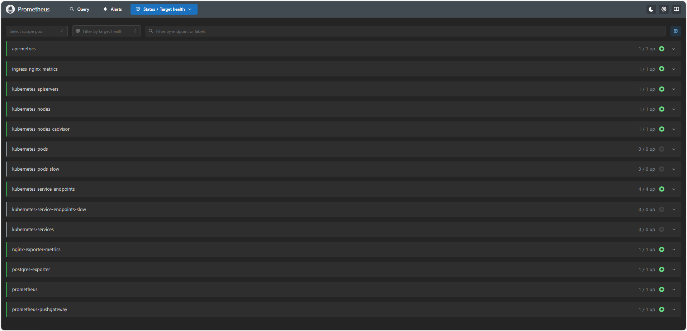
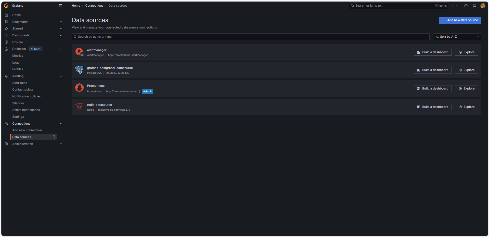
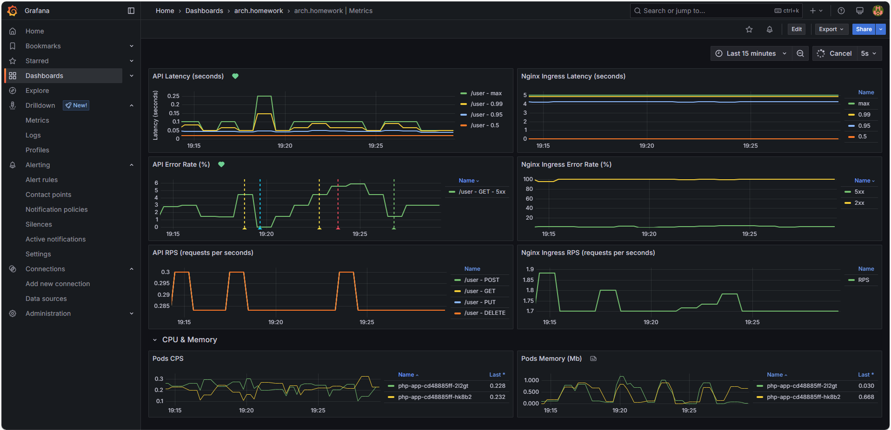
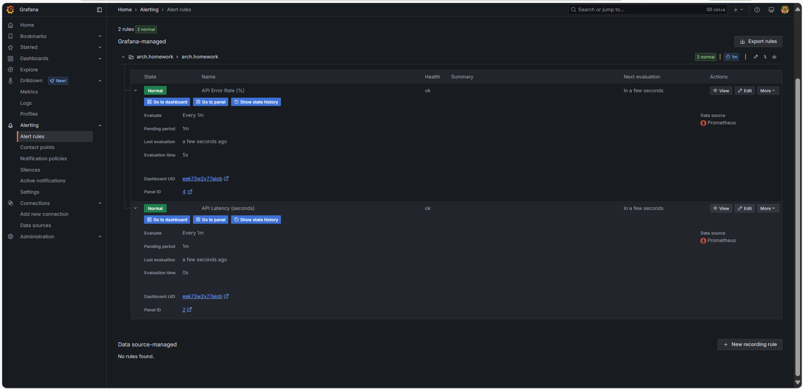

# ДЗ: Prometheus. Grafana

## Окружение
#### DockerHub
- https://hub.docker.com/r/confuciy/otus-lesson-5-user-service-metrics

#### GitHub
- https://github.com/confuciy/microservice_architecture/tree/main/lesson-5
- `git clone https://github.com/confuciy/microservice_architecture.git <your_folder>`

#### Коллекция Postman
- postman-collection.json
- base_url = http://arch.homework
- id = 1
```
newman run postman_collection.json -n 1000 (~20 минут по времени)
```

<b style="color: red">В скриптах настроены периодические падения в 500-ю для их эмуляции.</b>

## Prometheus:
```
Сбор метрик настроен через сервисы с указанием таргетов Prometheus
helm upgrade prometheus prometheus-community/prometheus -f ./monitoring/prometheus-values.yaml --set-file extraScrapeConfigs=./monitoring/prometheus-metrics.yaml
```

Метрики собираются с:
- Nginx Ingress Controller;
- Nginx Exporter;
- API metrics (добавленные в приложение метрики);
- Postgres Exporter.



## Granana:

#### Источники данных



Postgresql и Redis добавлены для настройки их мониторинга в будущем.

#### Дашборды:

- https://github.com/confuciy/microservice_architecture/tree/main/lesson-5/arch.homework_Metrics-1746116875580.json

По методам API (/health добавлять не стал):
1. Latency (response time) [seconds] с квантилями по 0.5, 0.95, 0.99, max;
2. Error Rate [%] - , количество 500-х ответов;
3. RPS.

По сервису в целом, взятые с nginx-ingress-controller:
1. Latency (response time) [seconds] с квантилями по 0.5, 0.95, 0.99, max;
2. Error Rate [%] - , количество 500-х ответов;
3. RPS.

По потреблению процессора и памяти:
1. Потребление подами приложения памяти [Mb]
2. Потребление подами приолжения CPU



#### Alerting - Alert Rules:

Настроен алерт на получение 500-х более чем 3% от общего числа запросов.
После превышения мониторинг 1 минуту до отправки алерта (почтой Grafana, не настроено).

Настроен алерт на время выполнение запросы более 2-х секунд.
После превышения мониторинг 1 минуту до отправки алерта (почтой Grafana, не настроено).

