# ДЗ: Backend for frontends. Apigateway

## Окружение
#### DockerHub
- https://hub.docker.com/repository/docker/confuciy/otus-lesson-6-apigateway/general

Приложение собрано из нескольких сервисов, каждый из своего образа.
```
Образы:
docker pull confuciy/otus-lesson-6-apigateway:php-app
docker pull confuciy/otus-lesson-6-apigateway:service-user
docker pull confuciy/otus-lesson-6-apigateway:service-auth
docker pull confuciy/otus-lesson-6-apigateway:service-notification
```
Для удобства все образы создаются из одного Dockerfile с разбивкой на target.
```
Например:
docker build -t confuciy/otus-lesson-6-apigateway:service-user --target=service-user .
```

#### GitHub
- https://github.com/confuciy/microservice_architecture/tree/main/lesson-6
- `git clone https://github.com/confuciy/microservice_architecture.git <your_folder>`

#### Настройки
Прописываем в C:\Windows\System32\drivers\etc\hosts:
```
185.236.28.169 arch.homework
```
##### Как работает:
```
IP белый, так что приложение можно попробовать через интернет (работает не всегда, иногда неттоп перегревается и виснет). 
Роутер перенаправляет внешние запросы на неттоп в домашней сети.
На неттопе поднят Nginx, который проксирует внешние запросы на Minikube. 
В Minikube происходит вся магия, ответ возвращается пользователю.
```

##### Запуск и остановка приложения:
```
Запуск, namespace default:
helm install php-app ./helm
```
```
Остановка:
helm uninstall php-app
```

## Приложение

#### Описание архитектурного решения и схема взаимодействия сервисов

Apigateway на основе ingress-nginx с аутентификацией пользователей по JWT-токенам.

##### Схема взаимодействия сервисов на примере авторизации и просмотра профиля пользователя
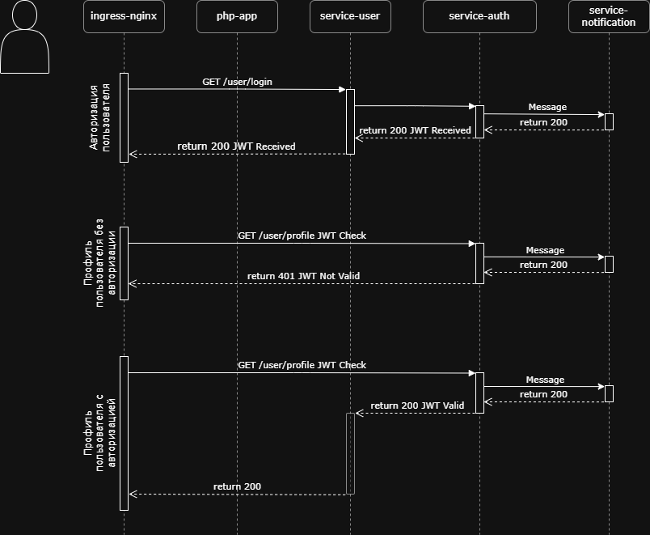

#### Тесты Postman
#### Коллекция Postman
- postman-collection.json
- base_url = http://arch.homework
- id = 0
- first_user_id = 0
- email_iterator = 0
- second_user_id = 0

Для демонстрации через Postman добавлен путь отображения профиля пользовтеля через GET /user/{{id_пользователя}}

```
newman run postman_collection.json
```

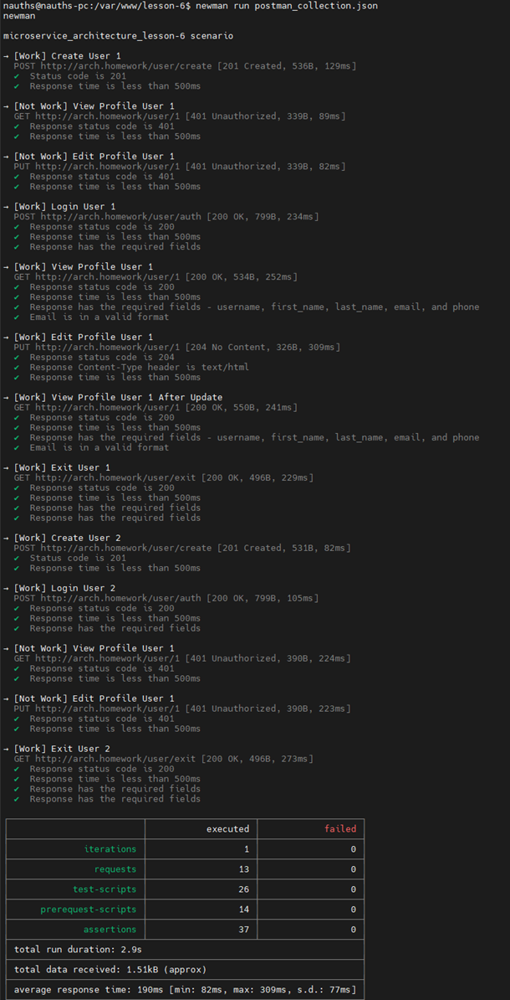

Сценарий:
- регистрация пользователя 1;

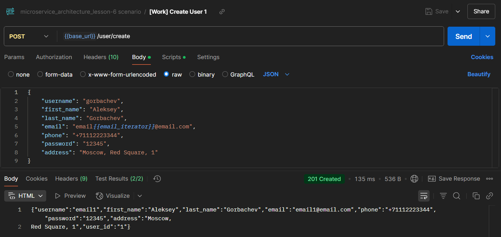

- получение профиля пользователя 1 недоступно без логина;

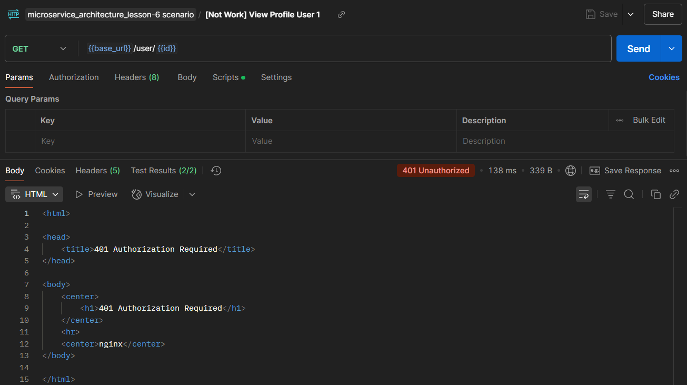

- изменение профиля пользователя 1 недоступно без логина;

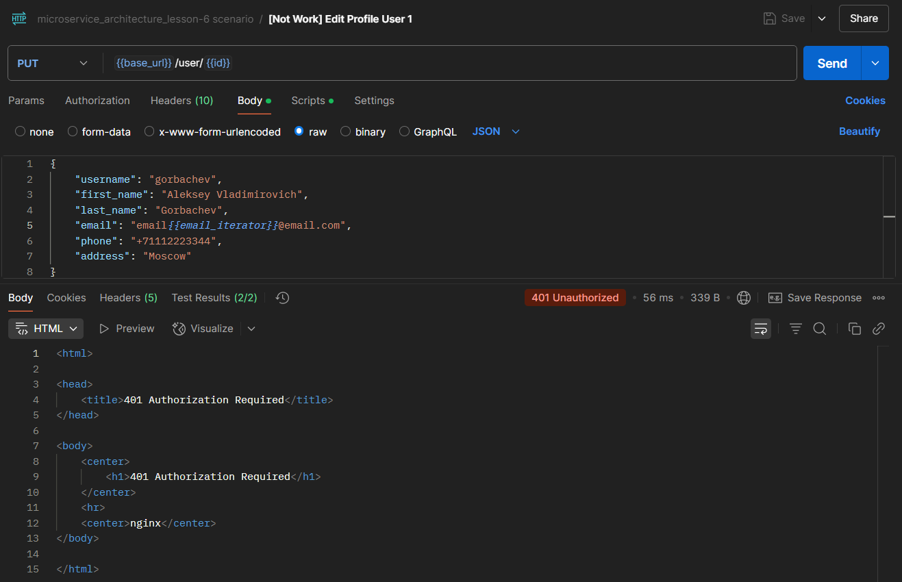

- вход пользователя 1;


- получение профиля пользователя 1

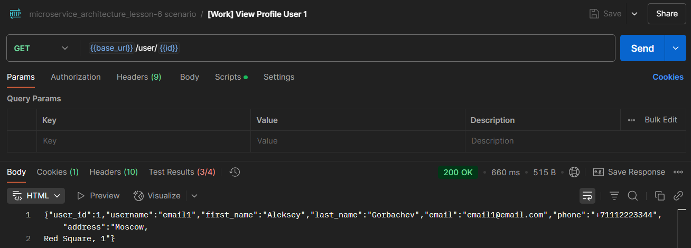

- изменение профиля пользователя 1;

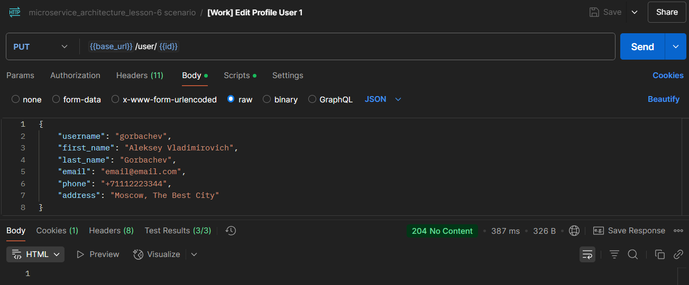

- проверка, что профиль пользователя 1 поменялся;

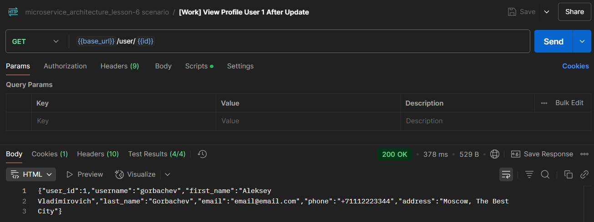

- выход пользователя 1;

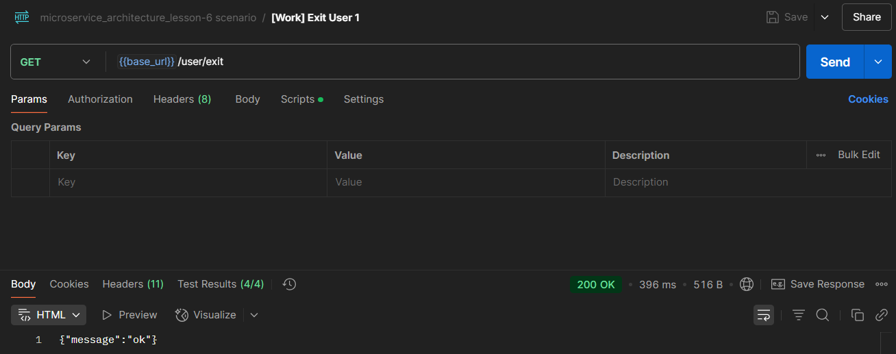

- регистрация пользователя 2;

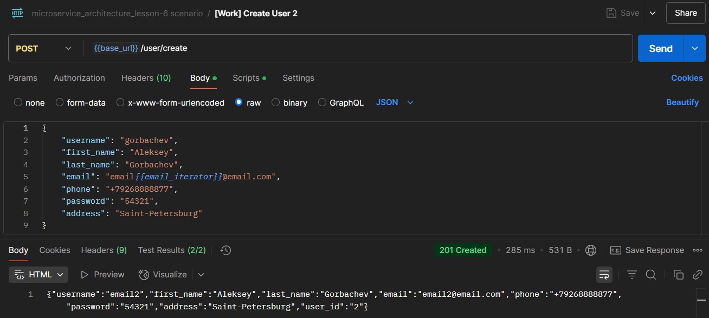

- вход пользователя 2;

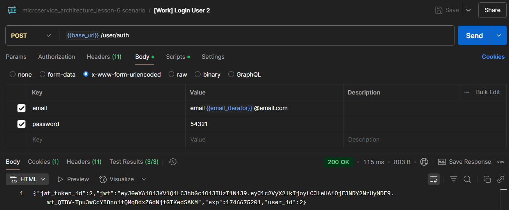

- проверка, что пользователь 2 не имеет доступа на чтение профиля пользователя 1;

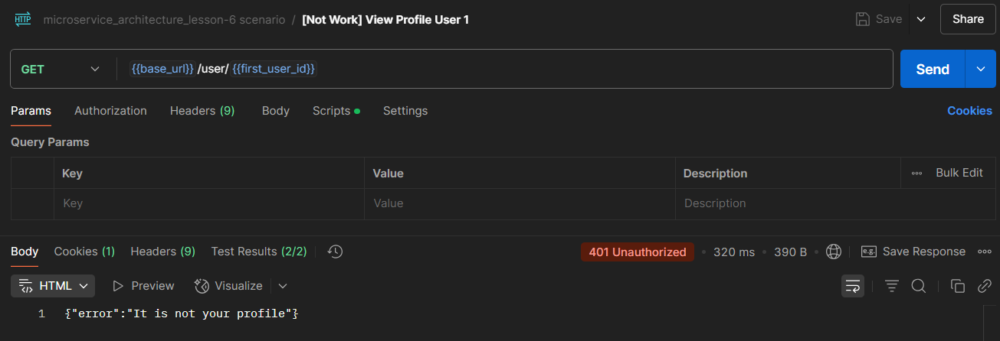

- проверка, что пользователь 2 не имеет доступа на редактирование профиля пользователя 1.

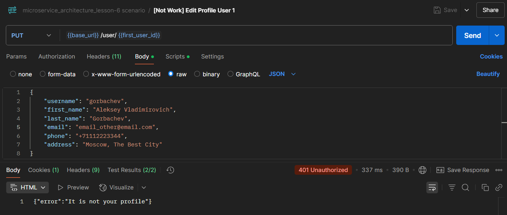

- выход пользователя 2;

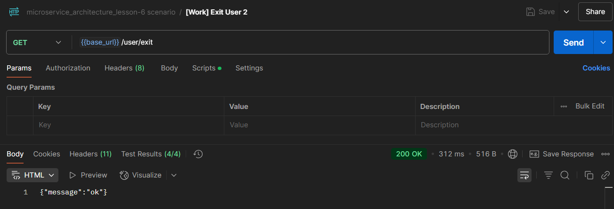
