# ДЗ: Stream processing

## Окружение
#### DockerHub
- https://hub.docker.com/repository/docker/confuciy/otus-lesson-7-stream-processing/general

Приложение собрано из нескольких сервисов, каждый из своего образа.
```
Образы:
docker pull confuciy/otus-lesson-7-stream-processing:php-app
docker pull confuciy/otus-lesson-7-stream-processing:service-user
docker pull confuciy/otus-lesson-7-stream-processing:service-auth
docker pull confuciy/otus-lesson-7-stream-processing:service-notification
docker pull confuciy/otus-lesson-7-stream-processing:service-order
docker pull confuciy/otus-lesson-7-stream-processing:service-billing
```
Для удобства все образы создаются из одного Dockerfile с разбивкой на target.
```
Например:
docker build -t confuciy/otus-lesson-7-stream-processing:service-user --target=service-user .
```

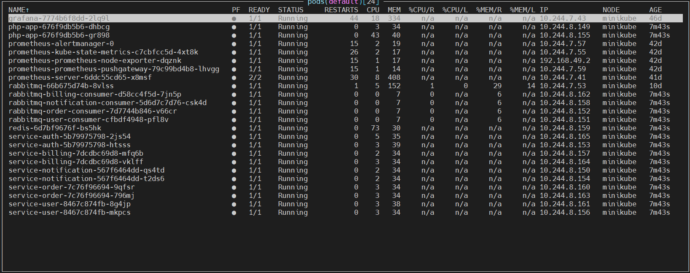

#### GitHub
- https://github.com/confuciy/microservice_architecture/tree/main/lesson-7
- `git clone https://github.com/confuciy/microservice_architecture.git <your_folder>`

#### Настройки
Прописываем в C:\Windows\System32\drivers\etc\hosts:
```
185.236.28.169 arch.homework
```
##### Как работает:
```
IP белый, так что приложение можно попробовать через интернет (работает не всегда, иногда неттоп перегревается и виснет). 
Роутер перенаправляет внешние запросы на неттоп в домашней сети.
На неттопе поднят Nginx, который проксирует внешние запросы на Minikube. 
В Minikube происходит вся магия, ответ возвращается пользователю.
```

##### Запуск и остановка приложения:
```
Запуск, namespace default:
helm install php-app ./helm
```
```
Остановка:
helm uninstall php-app
```

## Приложение

#### Описание архитектурного решения и схема взаимодействия сервисов

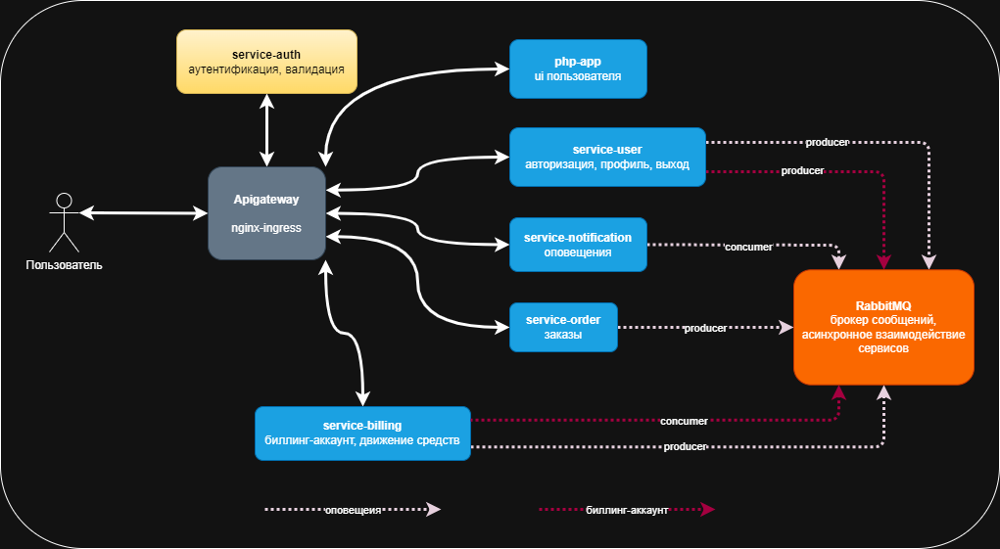

##### Схема взаимодействия сервисов на примере создания заказа

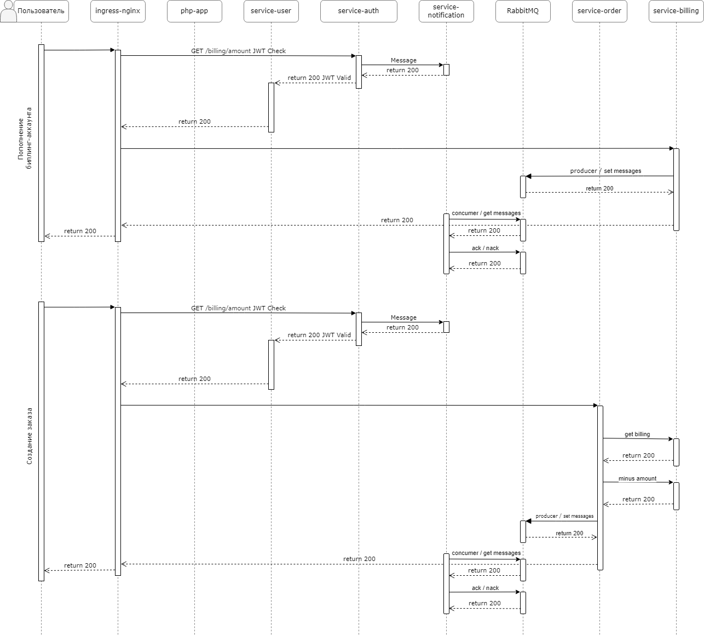

#### Swagger (OpenAPI)

Методы сервисов описаны в документации - http://arch.homework/api/documentation/

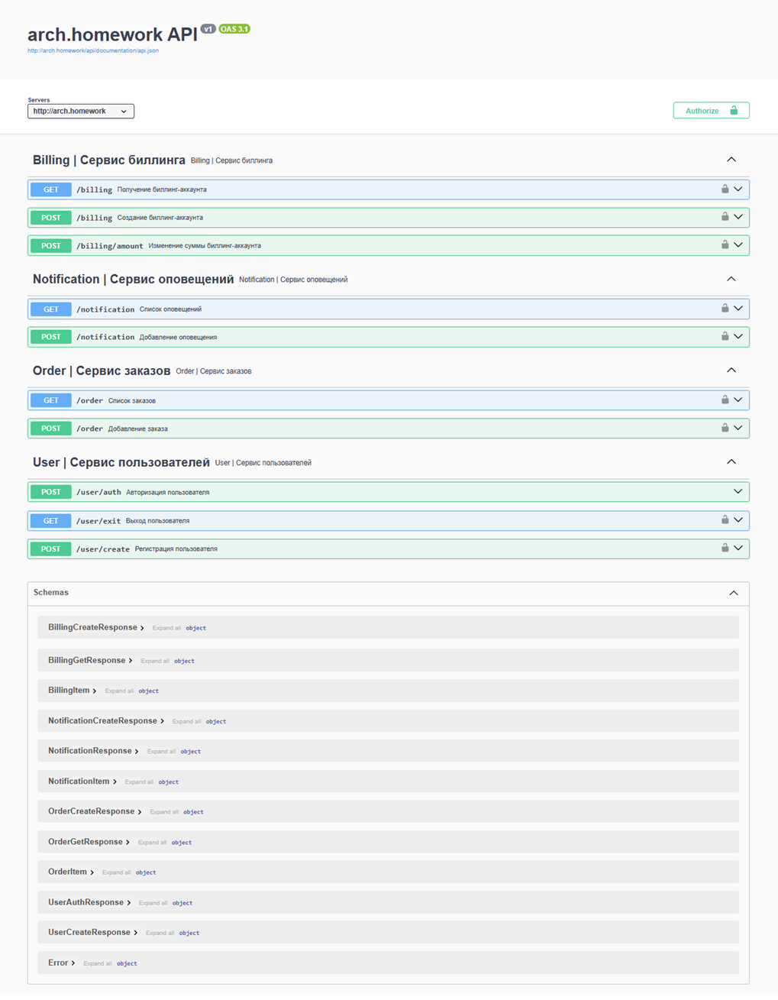

#### Тесты Postman
#### Коллекция Postman
- postman-collection.json
- base_url = http://arch.homework
- id = 0
- email_iterator = 0

```
newman run postman_collection.json
```

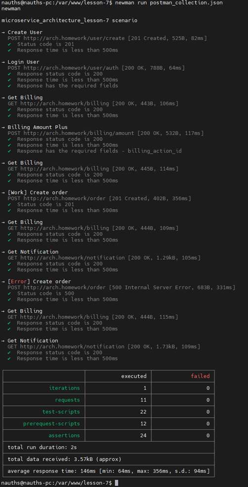

Сценарий:
- создание пользователя, также создается биллинг-аккаунт;

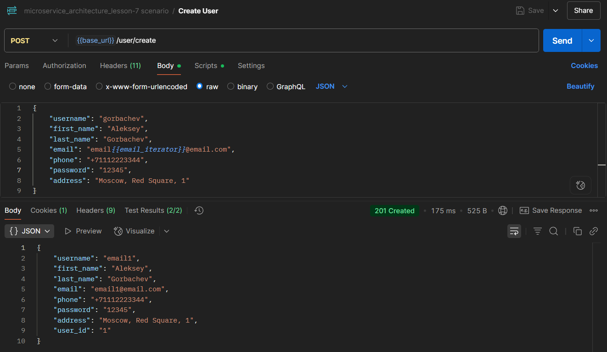

- вход пользователя;

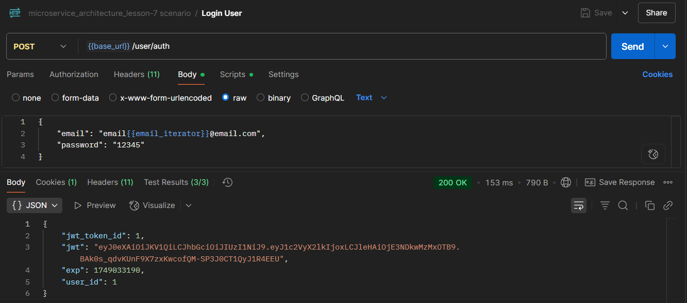

- просмотр баланса биллинг-аккаунта;


- пополнение баланса биллинг-аккаунта;

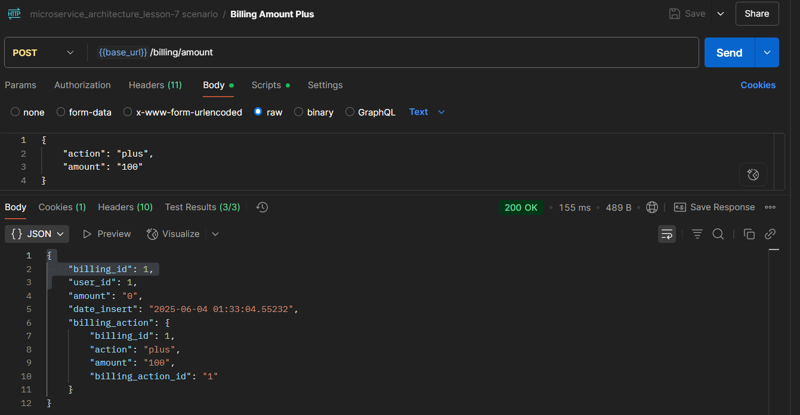

- просмотр баланса биллинг-аккаунта после пополнения;

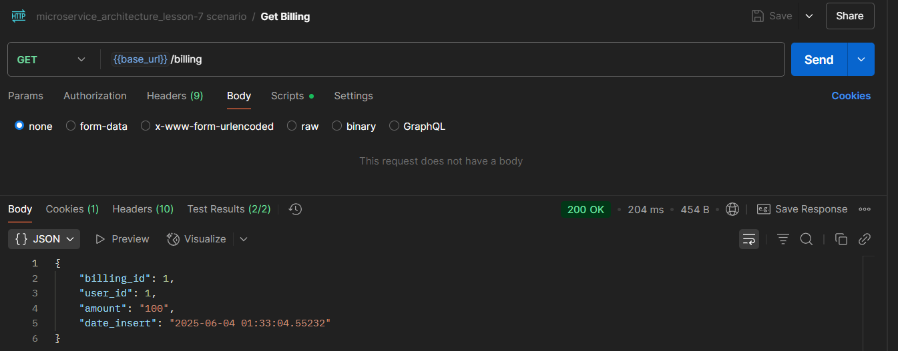

- создаем заказ, на который хватает средств;

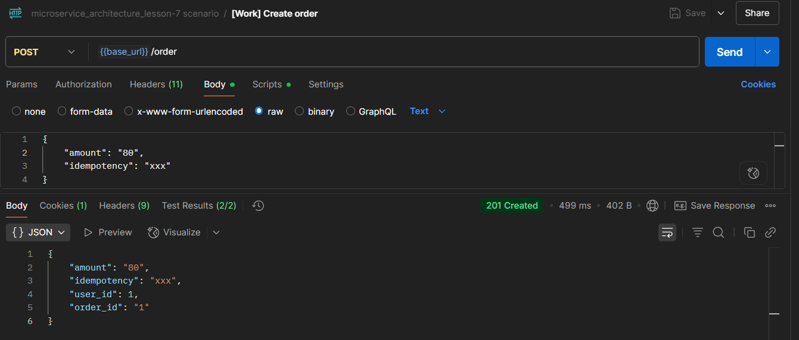

- просмотр баланса биллинг-аккаунта;

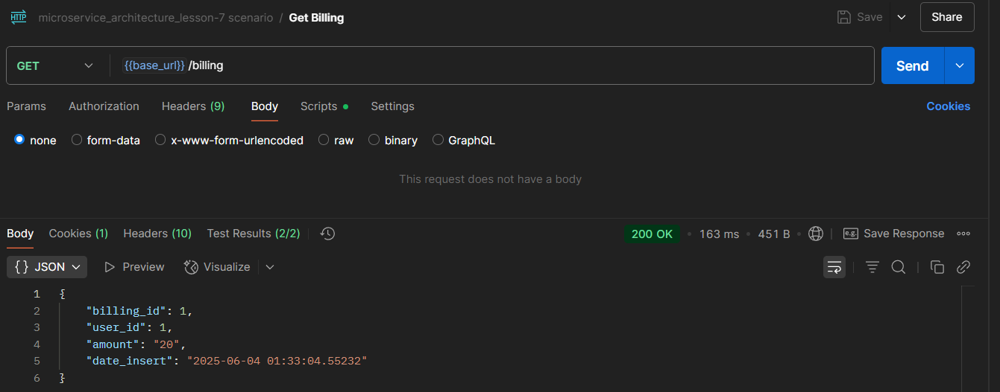

- просмотр оповещений;

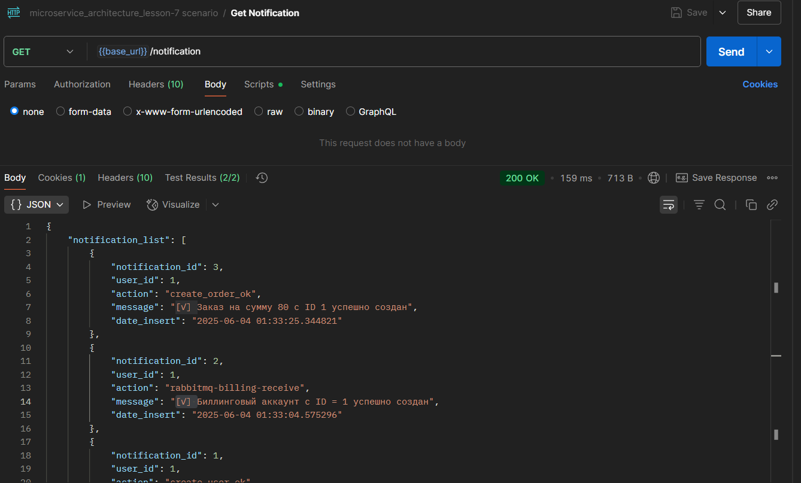

- создаем заказ, на который не хватает средств;

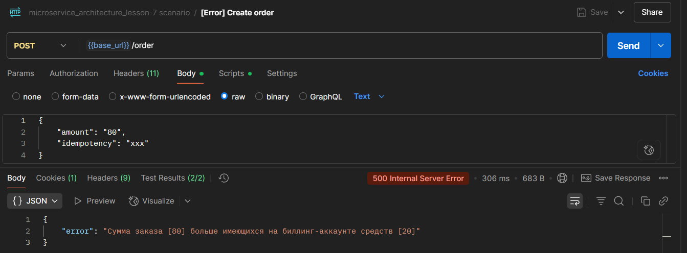

- просмотр баланса биллинг-аккаунта;


- просмотр оповещений;

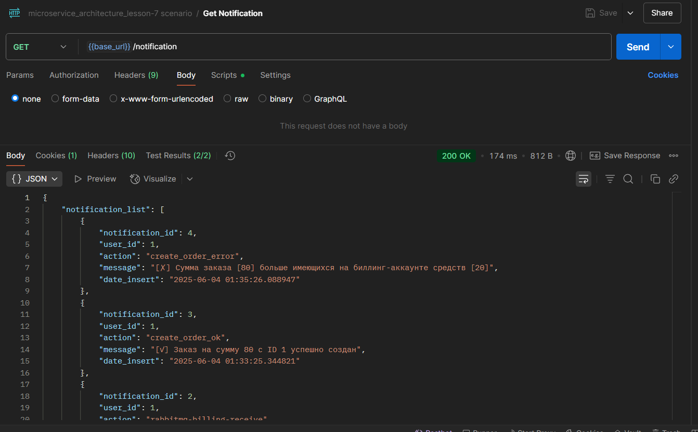
