# ДЗ: Распределенные транзакции

## Окружение
#### DockerHub
- https://hub.docker.com/repository/docker/confuciy/otus-lesson-8-saga/general
- Приложение собрано из нескольких сервисов, каждый из своего образа.
```
Образы:
docker pull confuciy/otus-lesson-8-saga:php-app
docker pull confuciy/otus-lesson-8-saga:service-user
docker pull confuciy/otus-lesson-8-saga:service-auth
docker pull confuciy/otus-lesson-8-saga:service-notification
docker pull confuciy/otus-lesson-8-saga:service-order
docker pull confuciy/otus-lesson-8-saga:service-billing
docker pull confuciy/otus-lesson-8-saga:service-warehouse
docker pull confuciy/otus-lesson-8-saga:service-delivery
```
Для удобства все образы создаются из одного Dockerfile с разбивкой на target.
```
Например:
docker build -t confuciy/otus-lesson-8-saga:service-user --target=service-user .
```


#### GitHub
- https://github.com/confuciy/microservice_architecture/tree/main/lesson-8
- `git clone https://github.com/confuciy/microservice_architecture.git <your_folder>`

#### Настройки
Прописываем в C:\Windows\System32\drivers\etc\hosts:
```
185.236.28.169 arch.homework
```
##### Как работает:
```
IP белый, так что приложение можно попробовать через интернет (работает не всегда, иногда неттоп перегревается и виснет). 
Роутер перенаправляет внешние запросы на неттоп в домашней сети.
На неттопе поднят Nginx, который проксирует внешние запросы на Minikube. 
В Minikube происходит вся магия, ответ возвращается пользователю.
```

##### Запуск и остановка приложения:
```
Запуск, namespace default:
helm install php-app ./helm
```
```
Остановка:
helm uninstall php-app
```

## Приложение

#### Описание архитектурного решения и схема взаимодействия сервисов

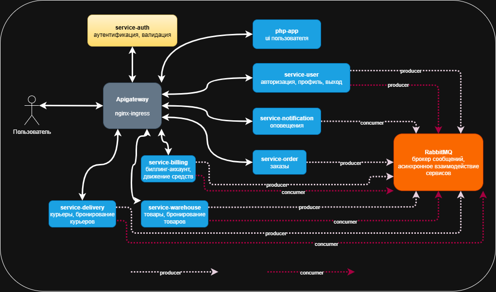

#### Схема взаимодействия сервисов на примере успешного создания заказа

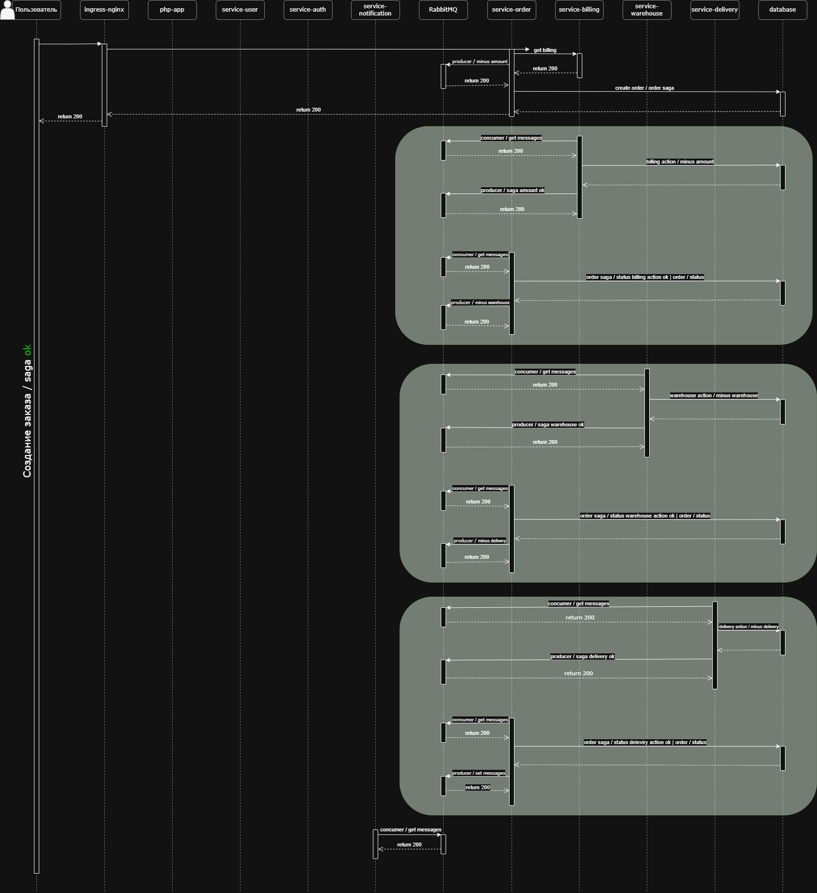

#### Схема взаимодействия сервисов на примере создания заказа c ошибкой на этапе бронирования товара на складе

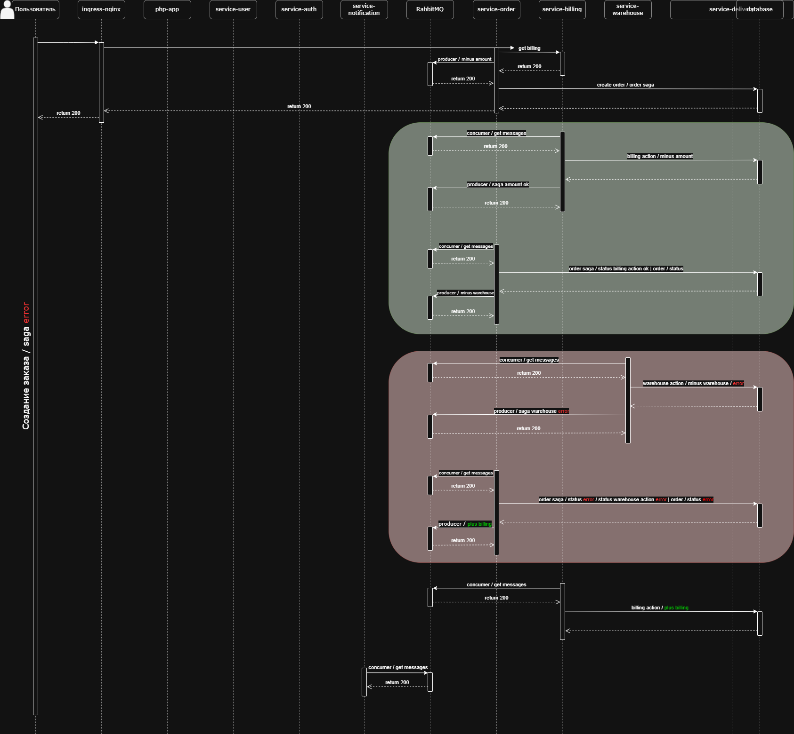

### Swagger (OpenAPI)

Методы сервисов описаны в документации - http://arch.homework/api/documentation/

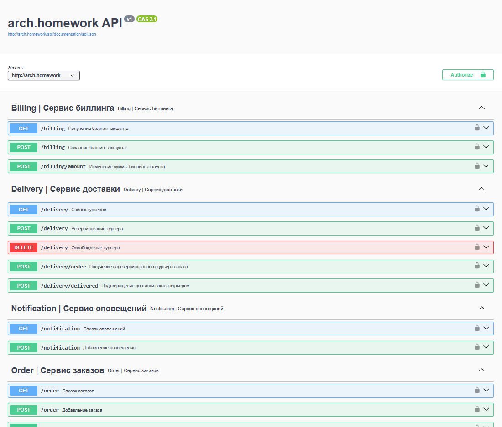

### Тесты Postman
#### Коллекция Postman
- postman-collection.json

```
newman run postman_collection.json --delay-request 100
```

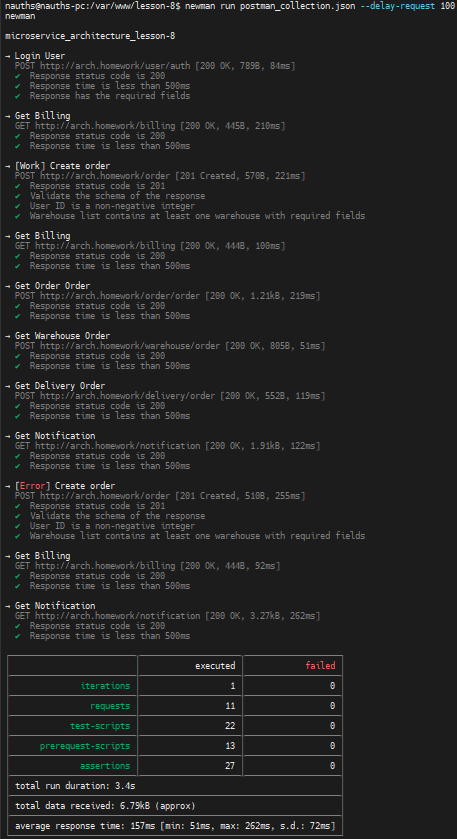

###Сценарий:

- вход пользователя;
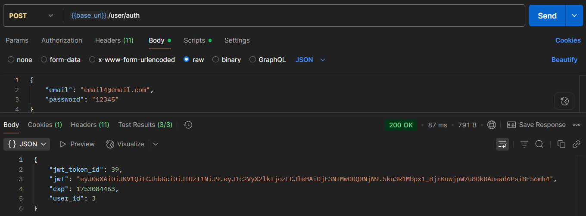

- просмотр баланса биллинг-аккаунта;
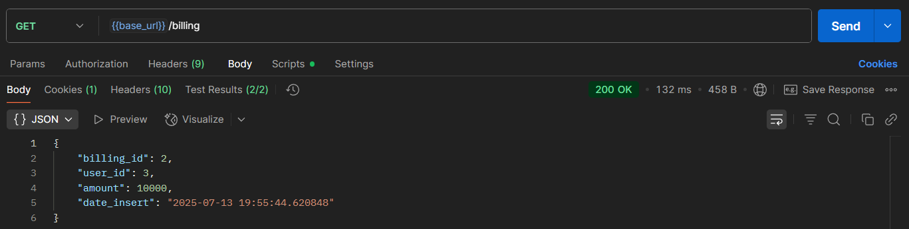

- создание заказа с 2 товарами;
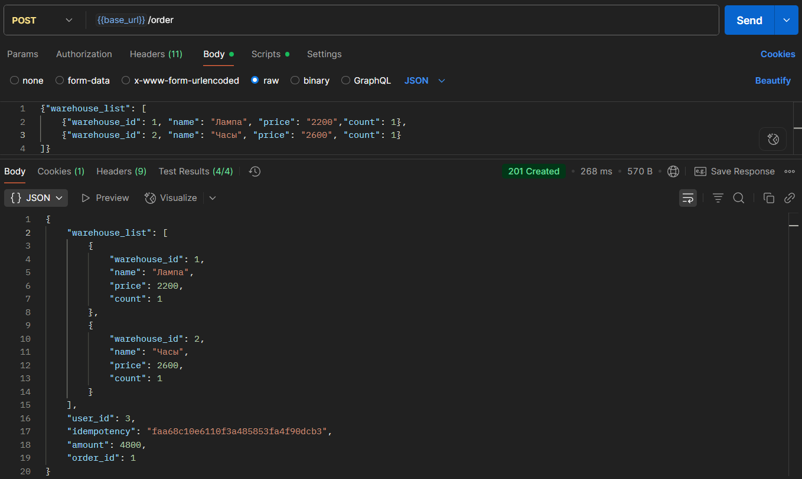


- просмотр баланса биллинг-аккаунта;
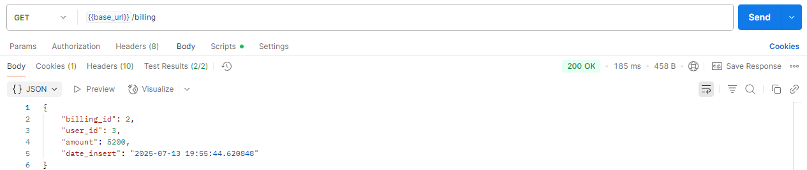

- просмотр созданного заказа;
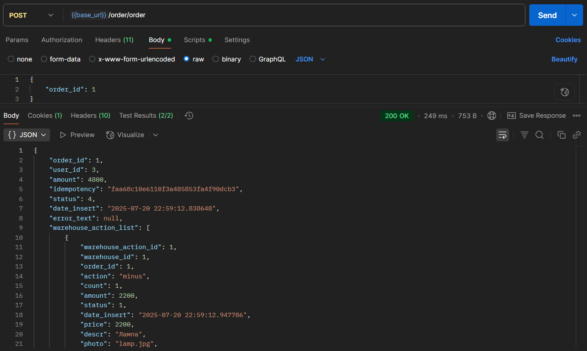


- просмотр списка товаров созданного заказа;
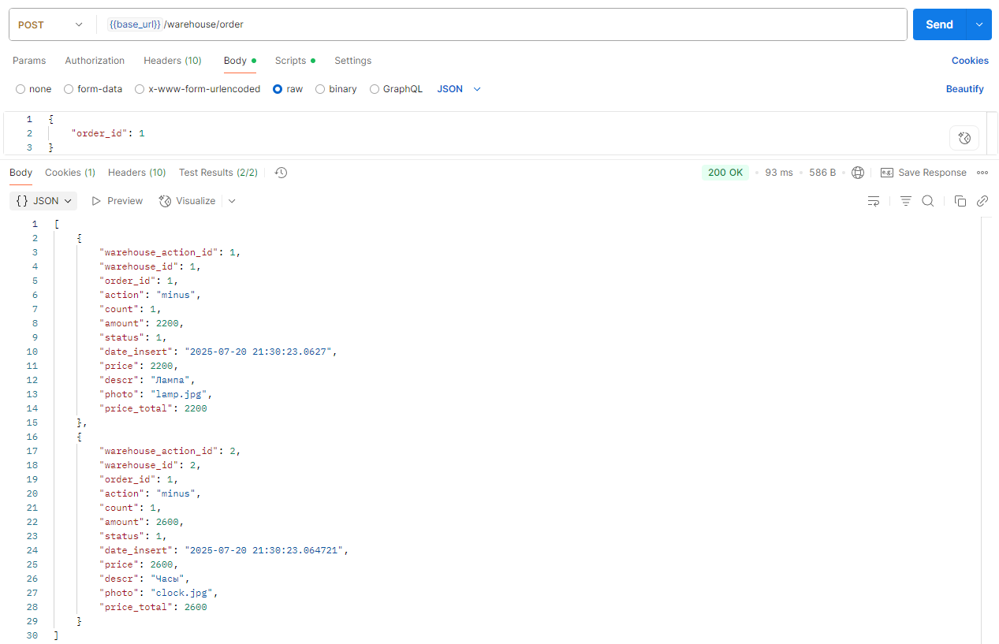


- просмотр зарезервированного курьера созданного заказа;
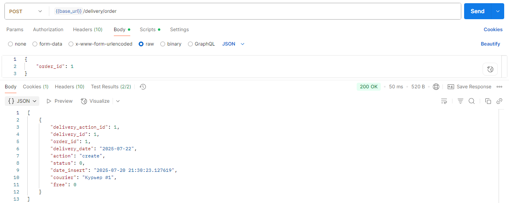

- просмотр оповещений;
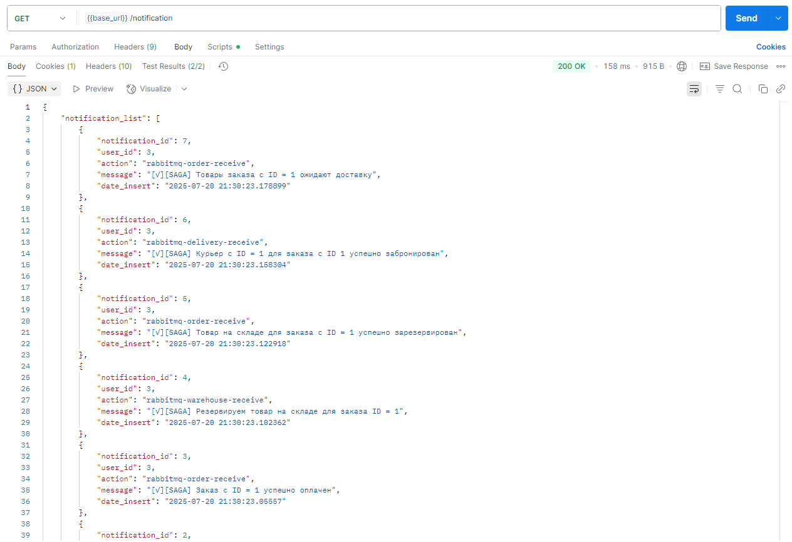


- создаем еще один заказ, с 1 товаром, которого уже нет на складе (зарезервирован первым);
- у нас проходит оплата, далее мы пытаемся забронировать товар, понимаем, что его нет;
- компенсационная транзакция возвращает деньги на счет;
- заказ отменяется;
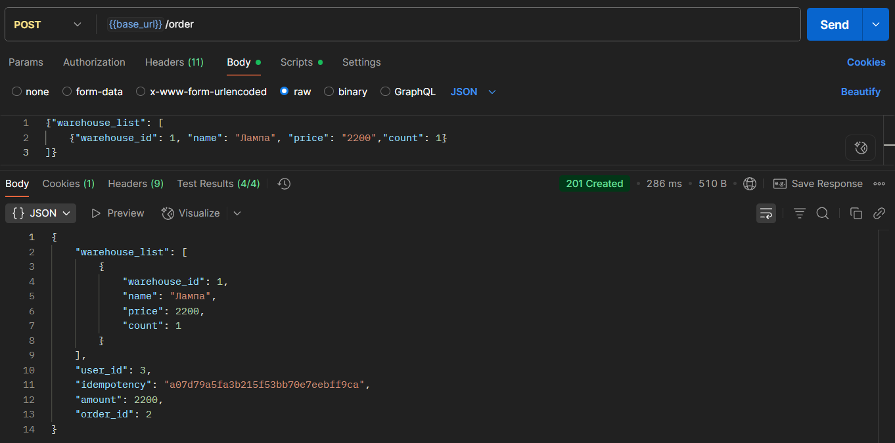

- просмотр баланса биллинг-аккаунта (средства вернулись);
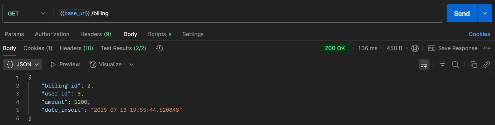

- просмотр оповещений;
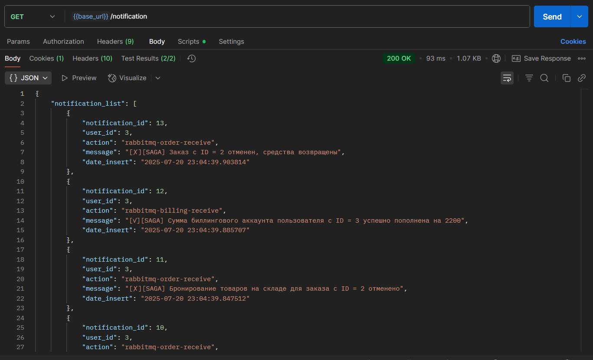


- доставляем первый заказ;
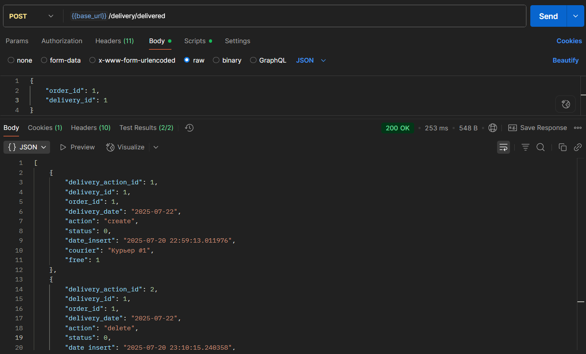


- просмотр оповещений;
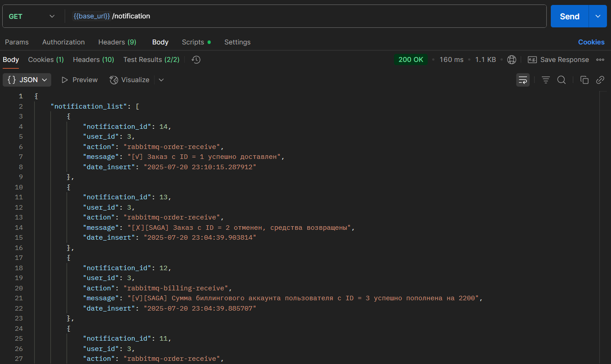
