# ДЗ: Идемпотентость и коммутативность API в HTTP и очередях

## Окружение
#### DockerHub
- https://hub.docker.com/repository/docker/confuciy/otus-lesson-9-idempotency/general
- Приложение собрано из нескольких сервисов, каждый из своего образа.
```
Образы:
docker pull confuciy/otus-lesson-9-idempotency:php-app
docker pull confuciy/otus-lesson-9-idempotency:service-user
docker pull confuciy/otus-lesson-9-idempotency:service-auth
docker pull confuciy/otus-lesson-9-idempotency:service-notification
docker pull confuciy/otus-lesson-9-idempotency:service-order
docker pull confuciy/otus-lesson-9-idempotency:service-billing
docker pull confuciy/otus-lesson-9-idempotency:service-warehouse
docker pull confuciy/otus-lesson-9-idempotency:service-delivery
```
Для удобства все образы создаются из одного Dockerfile с разбивкой на target.
```
Например:
docker build -t confuciy/otus-lesson-9-idempotency:service-user --target=service-user .
```

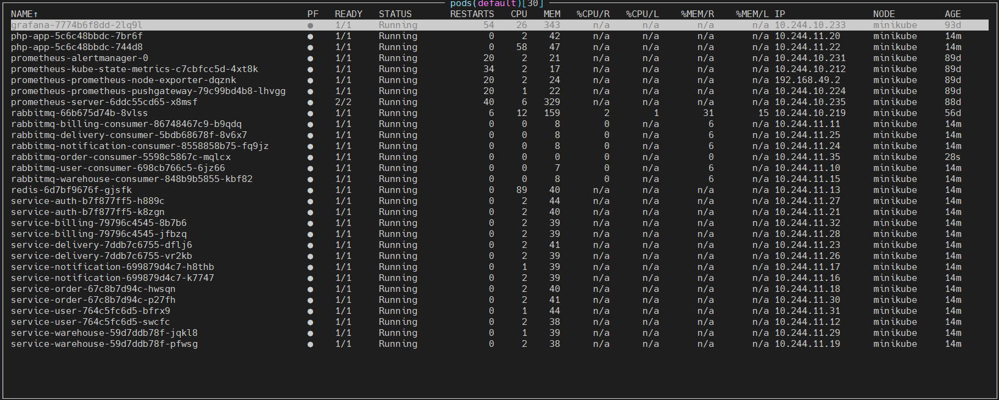

#### GitHub
- https://github.com/confuciy/microservice_architecture/tree/main/lesson-9
- `git clone https://github.com/confuciy/microservice_architecture.git <your_folder>`

#### Настройки
Прописываем в C:\Windows\System32\drivers\etc\hosts:
```
185.236.28.169 arch.homework
```
##### Как работает:
```
IP белый, так что приложение можно попробовать через интернет (работает не всегда, иногда неттоп перегревается и виснет). 
Роутер перенаправляет внешние запросы на неттоп в домашней сети.
На неттопе поднят Nginx, который проксирует внешние запросы на Minikube. 
В Minikube происходит вся магия, ответ возвращается пользователю.
```

##### Запуск и остановка приложения:
```
Запуск, namespace default:
helm install php-app ./helm
```
```
Остановка:
helm uninstall php-app
```

## HASH идемпотентности
- Для исключения создания повторного создания заказа проверяется его HASH;
- Если HASH уже есть в базе данных, пользователю предлагается подтвердить создание заказа (позволяет не терять клиентов, показано дальше);
- Если пользователь отказывается от повторного создания, заказ не создается;

## Приложение

#### Описание архитектурного решения и схема взаимодействия сервисов


### Swagger (OpenAPI)

Методы сервисов описаны в документации - http://arch.homework/api/documentation/


### Тесты Postman
#### Коллекция Postman
- postman-collection.json

```
newman run postman_collection.json --delay-request 100
```

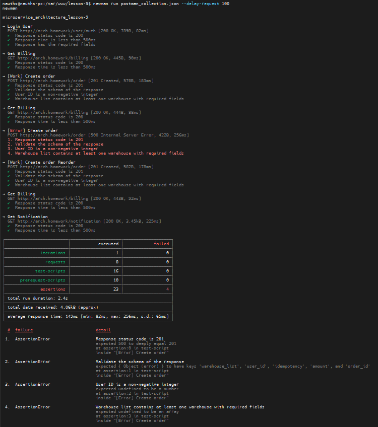

### Сценарий:

- конечное состояние в интерфейсе пользователя;
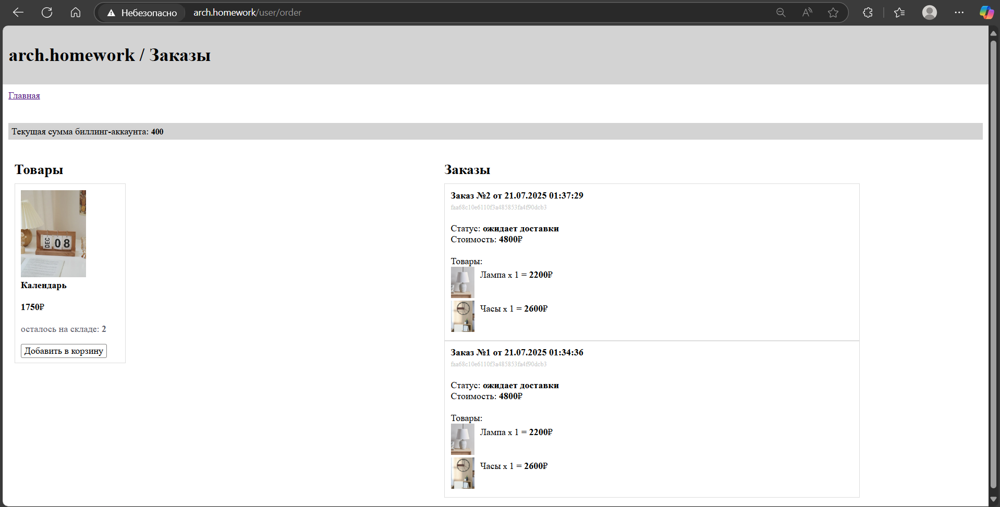

- вход пользователя;
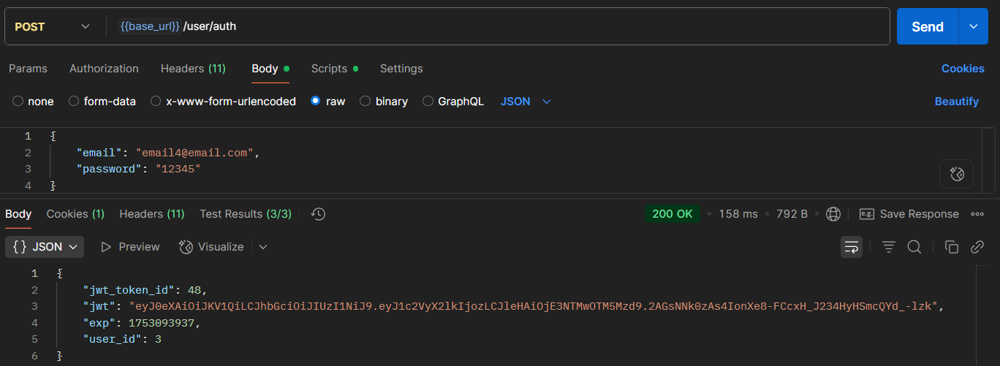

- просмотр баланса биллинг-аккаунта;


- создание заказа с 2 товарами;
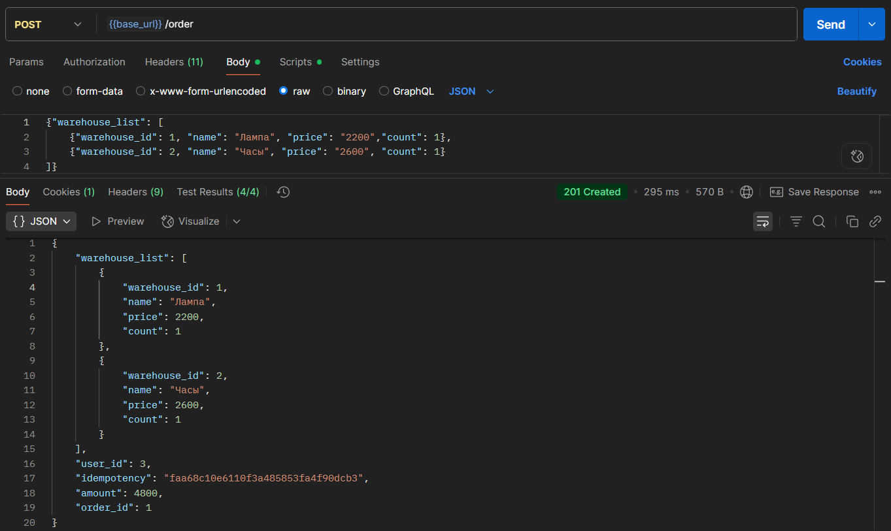

- просмотр баланса биллинг-аккаунта;
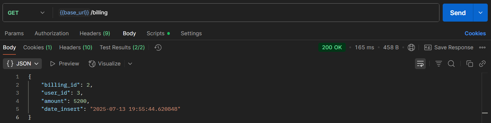

- повторное создание заказа с 2 товарами;
- здесь показано, как отработает сервис, если пользователь не подтвердит повторное создание заказа через интерфейс, по все равно сделает запрос;
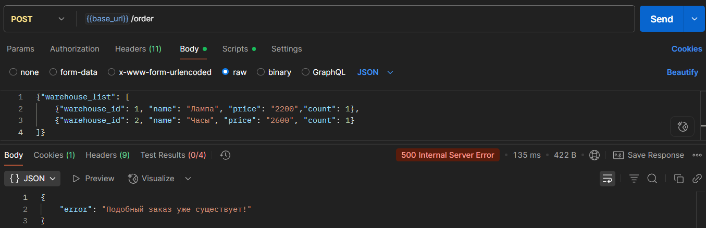

- повторное создание заказа с 2 товарами;
- здесь показано, как отработает сервис, если пользователь подтвердит повторное создание заказа через интерфейс или в запросе;
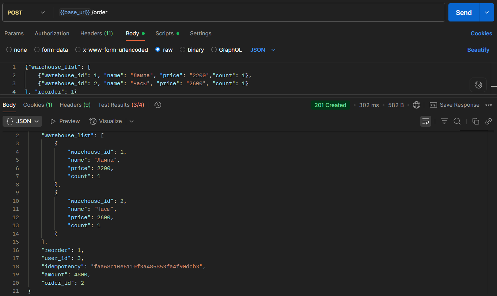

- интерфейс подтверждения повторного создания заказа;
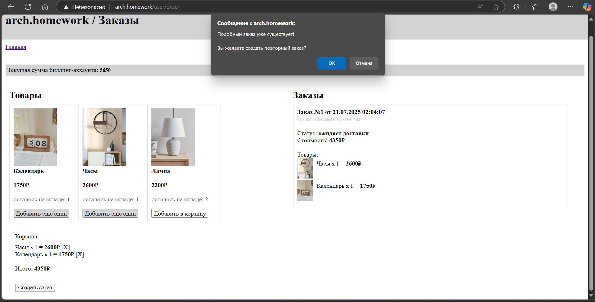

- теперь в базе данных два одинаковых заказа, как и хотел пользователь;
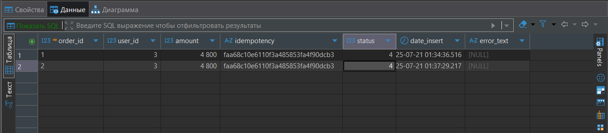

- просмотр баланса биллинг-аккаунта;
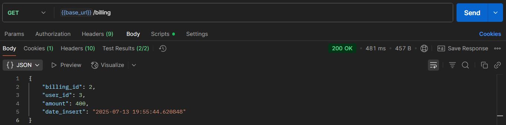

- просмотр оповещений;
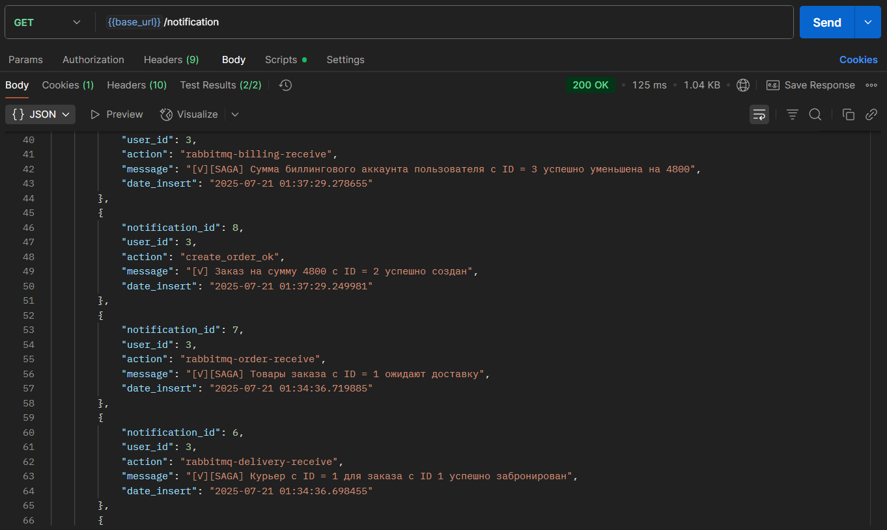
